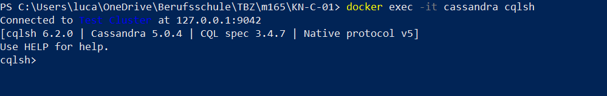
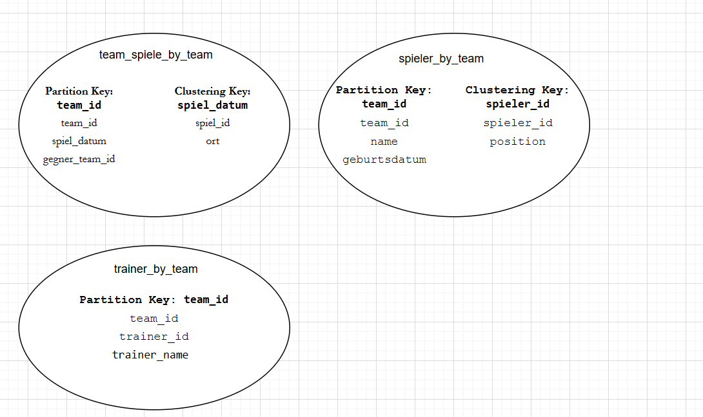
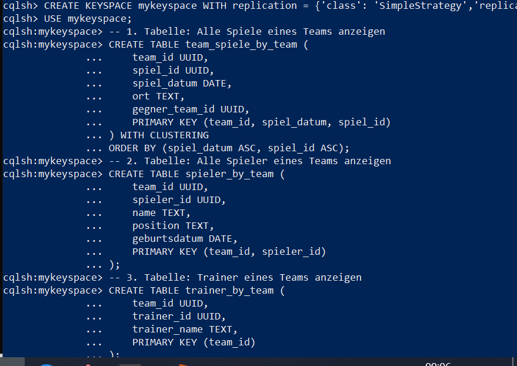

# A) Installation / Account erstellen

--- 

# B) Logisches Modell für Cassandra 

1. team_spiele_by_team
Dieses Modell dient dazu, alle Spiele eines bestimmten Teams schnell anzuzeigen, z. B. in einer Spielübersicht. Die Spiele werden nach team_id gespeichert und nach spiel_datum sortiert.

2. spieler_by_team
Diese Tabelle listet alle Spieler eines Teams auf und ermöglicht schnelle Abfragen nach Teamzugehörigkeit. Sie enthält relevante Spielerinformationen wie Name, Position und Geburtsdatum.

3. trainer_by_team
Mit diesem Modell kann man schnell den Trainer eines Teams abrufen. Es speichert pro team_id die zugehörige trainer_id und optional den Namen.

---

# C) Physisches Modell für Cassandra 

