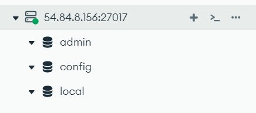
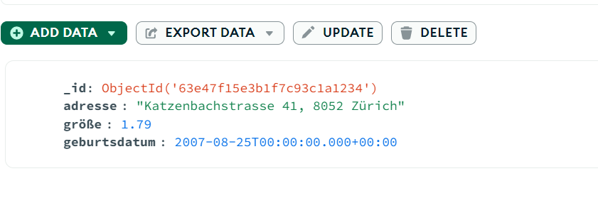
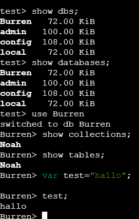

# MongoDB Setup und Konfiguration

## 1. authSource=admin

Der Parameter `authSource=admin` sorgt dafür, dass MongoDB bei der Authentifizierung die `admin`-Datenbank verwendet. Das ist korrekt, weil der Benutzer in der `admin`-Datenbank erstellt wurde.

## 2. sed Befehle

### Erster Befehl
Aktiviert die Authentifizierung in der MongoDB-Konfigurationsdatei, indem er `authorization: enabled` hinzufügt.

### Zweiter Befehl
Erlaubt Verbindungen von allen IP-Adressen, indem `bindIp` von `127.0.0.1` auf `0.0.0.0` gesetzt wird.

### Überprüfen der Änderungen

## Warum der Umweg mit ISODate()?
MongoDB verwendet für Datumswerte den speziellen ISODate-Datentyp, um eine präzise Zeitverarbeitung zu gewährleisten. Wird ein Datum als String gespeichert, können keine Zeitvergleiche oder Berechnungen durchgeführt werden. Daher ist es notwendig, das Datum mit ISODate() korrekt zu definieren, damit MongoDB es richtig verarbeitet und vergleicht.

# C) 

``show dbs;``
Zeigt alle Datenbanken auf dem MongoDB-Server an.

``show databases;``
Ein alternativer Befehl zu show dbs;, der ebenfalls alle verfügbaren Datenbanken anzeigt.

``use Burren;``
Wechselt zur angegebenen Datenbank. Der Name der Datenbank wird nach use eingegeben, z. B. use Muster.

``show collections;``
Listet alle Collections in der aktuellen Datenbank auf. In MongoDB ist eine Collection eine Sammlung von Dokumenten.

``show tables;``
In MongoDB entspricht dieser Befehl dem Befehl show collections;. MongoDB verwendet keine echten Tabellen, sondern Collections, und dieser Befehl zeigt alle Collections an.

Collections in MongoDB sind vergleichbar mit Tables in relationalen Datenbanken, aber sie haben keine feste Struktur. Eine Collection speichert Dokumente, die unterschiedliche Felder und Datentypen enthalten können.

Tables in relationalen Datenbanken haben eine vordefinierte Struktur, bei der jede Zeile die gleiche Anzahl und Art von Spalten hat. Daten in Tabellen sind strikt strukturiert und folgen einem festen Schema.