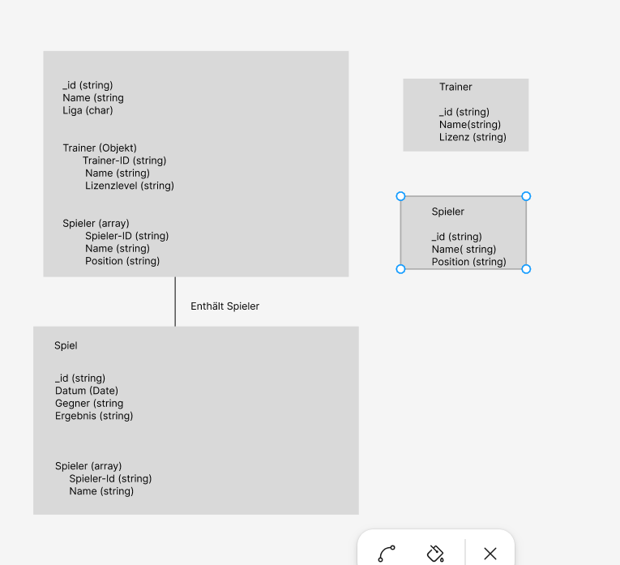

# Datenmodell: Mannschaften, Spieler, Trainer und Spiele

## Entitäten und Attribute

### Mannschaften
- **Team-ID** (int) – Eindeutige Identifikation der Mannschaft  
- **Name** (string) – Name der Mannschaft  
- **Liga** (char) – Liga, in der die Mannschaft spielt  

### Spieler
- **Spieler-ID** (int) – Eindeutige Identifikation des Spielers  
- **Name** (string) – Name des Spielers  
- **Alter** (int) – Alter des Spielers  

### Trainer
- **Trainer-ID** (int) – Eindeutige Identifikation des Trainers  
- **Name** (string) – Name des Trainers  
- **Lizenz** (string) – Lizenzlevel des Trainers  

### Spiele
- **Spiel-ID** (int) – Eindeutige Identifikation des Spiels  
- **Datum** (date) – Datum des Spiels  
- **Ergebnis** (string) – Ergebnis des Spiels  

## Beziehungen

- **Eine Mannschaft hat genau einen Trainer**, aber ein Trainer kann mehrere Mannschaften trainieren (**1:n**).  
- **Eine Mannschaft besteht aus mehreren Spielern**, aber ein Spieler gehört genau zu einer Mannschaft (**1:m**).  
- **Ein Spiel besteht aus mehreren Spielern**, und ein Spieler kann in mehreren Spielen auftreten (**m:m**).  
- **Ein Trainer kann mehrere Spiele betreuen**, und ein Spiel kann mehrere Trainer haben (**m:m**).  

# Logisches Datenmodell für Baseball-Datenbank

## 1. Bild des logischen Datenmodells

## 2. Erklärung der Verschachtelungen

### Struktur des Modells
Das logische Datenmodell wurde für eine Baseball-Datenbank erstellt und enthält folgende Entitäten:
- **Mannschaften** (`_id`, `Name`, `Liga`, `Trainer`, `Spieler`)
- **Spieler** (`_id`, `Name`, `Position`)
- **Trainer** (`_id`, `Name`, `Lizenz`)
- **Spiele** (`_id`, `Datum`, `Gegner`, `Ergebnis`, `Spieler`)

### Verschachtelungen
1. **Mannschaften → Spieler (Array)**
   - Eine Mannschaft besteht aus mehreren Spielern. Anstatt eine separate Relationstabelle zu nutzen, wurde entschieden, die Spieler direkt als Array in die Mannschaft zu integrieren.  
   - Vorteil: Direkter Zugriff auf alle Spieler einer Mannschaft ohne zusätzliche Queries.

2. **Mannschaften → Trainer (Objekt)**
   - Jeder Trainer gehört genau zu einer Mannschaft. Deshalb wurde der Trainer als eingebettetes Objekt in der Mannschaft gespeichert.  
   - Vorteil: Direkte Zuordnung ohne zusätzliche Verknüpfungstabellen.

3. **Spiele → Spieler (Array)**
   - Jedes Spiel speichert die teilnehmenden Spieler als Array mit ihrer ID und ihrem Namen.  
   - Vorteil: Schneller Zugriff auf die Spieler, die an einem bestimmten Spiel teilgenommen haben.

### Gründe für diese Verschachtelungen
- **Leistungsoptimierung**: Häufige Abfragen wie „Alle Spieler eines Teams“ oder „Trainer einer Mannschaft“ können ohne teure Joins direkt beantwortet werden.
- **Einfache Abfrage-Struktur**: MongoDB erlaubt das effiziente Arbeiten mit Arrays und eingebetteten Dokumenten.
- **Kompakte Datenstruktur**: Durch das Einbetten von Objekten und Arrays bleibt das Modell flexibel und speichert Daten konsistent.
