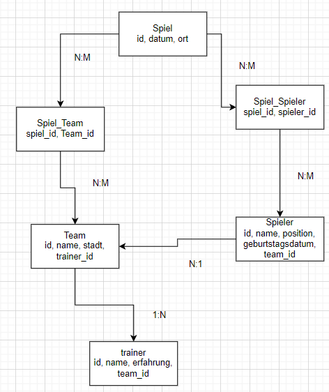
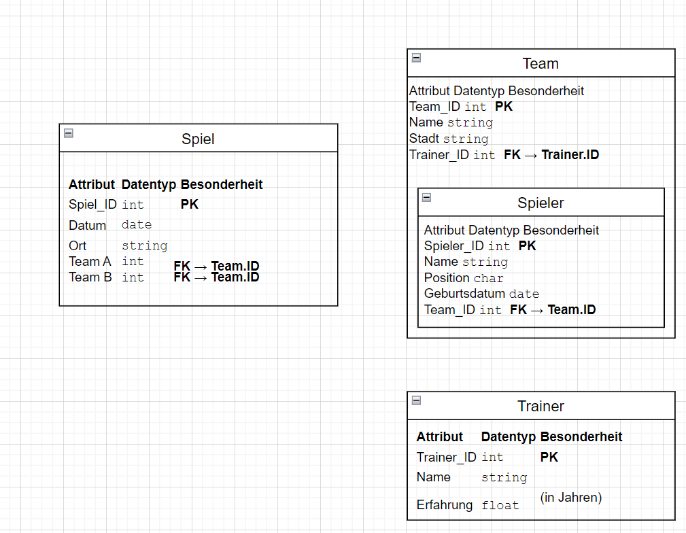

# A) Konzeptionelles Datenmodell (30%)
## Erklärungen zu den Entitäten und Beziehungen
### Entitäten:

**1. Spieler**
- Enthält Informationen über Baseballspieler.
- Attribute: ID (Primärschlüssel), Name, Position (z. B. Pitcher, Catcher), Geburtsdatum, Team_ID (Fremdschlüssel zu Team).

**2. Team**
- Repräsentiert ein Baseballteam.
- Attribute: ID (Primärschlüssel), Name, Stadt (wo das Team ansässig ist), Trainer_ID (Fremdschlüssel zu Trainer).

**3. Trainer**
- Speichert Informationen über die Trainer der Teams.
- Attribute: ID (Primärschlüssel), Name, Erfahrung (Anzahl Jahre als Trainer), Team_ID (Fremdschlüssel zu Team).

**4. Spiel**
- Speichert Daten über ein Baseballspiel.
- Attribute: ID (Primärschlüssel), Datum (Spieltermin), Ort (Austragungsort).

**5. Spiel_Team (Zwischentabelle für N:M-Beziehung zwischen Team und Spiel)**
- Ein Spiel kann mehrere Teams haben, und ein Team kann an mehreren Spielen teilnehmen.
- Attribute: Spiel_ID (Fremdschlüssel zu Spiel), Team_ID (Fremdschlüssel zu Team).

## Beziehungen:

**1. Spieler → Team (N:1)**
Ein Spieler gehört genau einem Team.
Ein Team kann mehrere Spieler haben.

**2. Team → Trainer (1:N)**
Ein Team hat genau einen Trainer.
Ein Trainer kann mehrere Teams über die Jahre betreuen (z. B. wenn er zu einem neuen Team wechselt).

**3. Spiel ↔ Team (N:M)**
Ein Spiel kann mehrere Teams beinhalten (Heim- und Auswärtsteam).
Ein Team kann an mehreren Spielen teilnehmen.
Wird durch die Zwischentabelle Spiel_Team umgesetzt.

---

# B) Logisches Datenmodell

## Meine Verschachtelung

|Entität|	Verschachtelt oder referenziert?	|Grund|
| ----------- | ------------------ | ------------- |
|Spieler in Team|	Eingebettet	|Spieler gehören logisch zu einem Team und werden oft gemeinsam abgefragt.|
|Trainer in Team|	Referenziert|	Trainer kann mehrere Teams haben, Änderungen sollten einfach sein.|
|Teams in Spiel|	Referenziert|	Teams existieren unabhängig und treten in mehreren Spielen auf.|

## Warum Verschachtelung
MongoDB nutzt NoSQL-Dokumentenstrukturen, die es ermöglichen, Daten in verschachtelten (eingebetteten) Dokumenten statt mit relationalen Tabellen zu speichern.