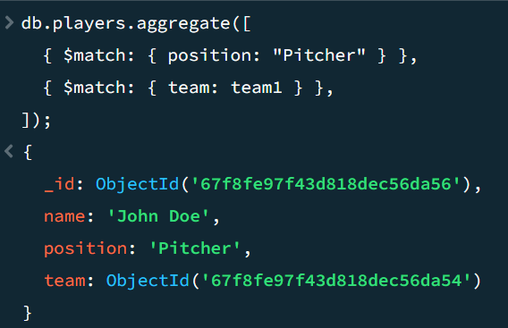

# A) Aggregationen (50%)

## 1. Zwei $match-Anweisungen separat geschaltet

**Beschreibung:** Erst nach Team, dann nach Position gefiltert.

## 2. $match, $project, $sort

**Beschreibung**: Spieler über 25, nur Name + Alter gezeigt, absteigend sortiert.

## 3. $sum (Gesamte Spieler pro Team zählen)

**Beschreibung**: Zählt wie viele Spieler pro Team.

## 4. $group (Spieler nach Position gruppieren)

**Beschreibung**: Gruppiert Spieler nach Position und listet Namen.

# B) Join-Aggregation (30%)

## 1. $lookup von Team zu Coach

**Beschreibung**: Holt Coach-Infos zum Team über $lookup.

## 2. $lookup mit $unwind, $match, $project

**Beschreibung**: Nur Teams mit Coach über 40, zeigt Name von Team + Coach.

# C) Unter-Dokumente / Arrays (20%)

## 1. Nur Unterdokumente (players im Spiel)

**Beschreibung**: Zeigt nur das players-Feld aus jedem Spiel.

## 2. Nach Feld im Unterdokument filtern (Spiele mit bestimmten Spieler)

**Beschreibung**: Findet Spiele, wo ein Spieler „Max“ heißt.

## 3. $unwind auf players

**Beschreibung**: Macht aus jedem Spieler im Array ein einzelnes Dokument.

