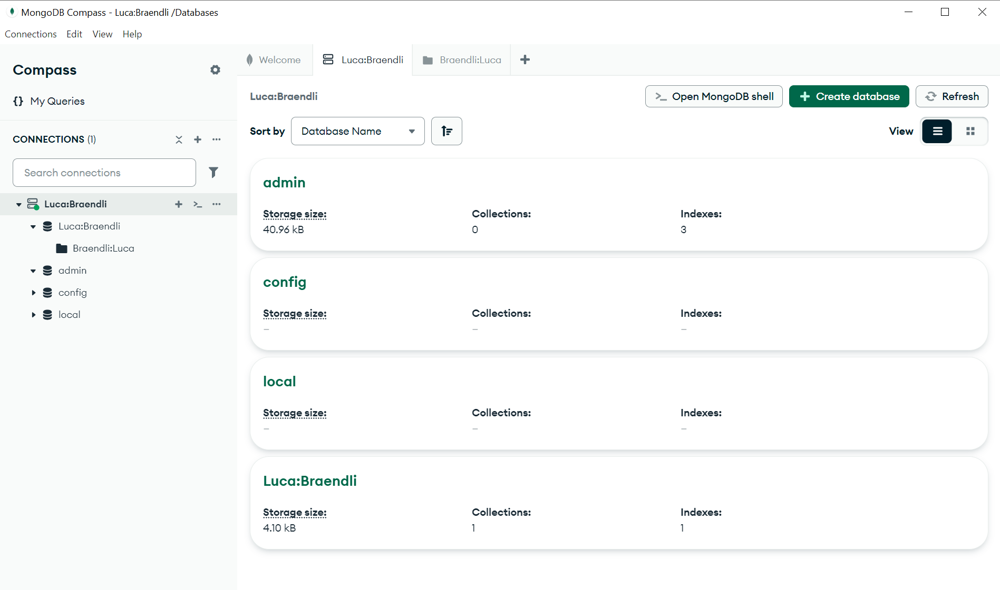
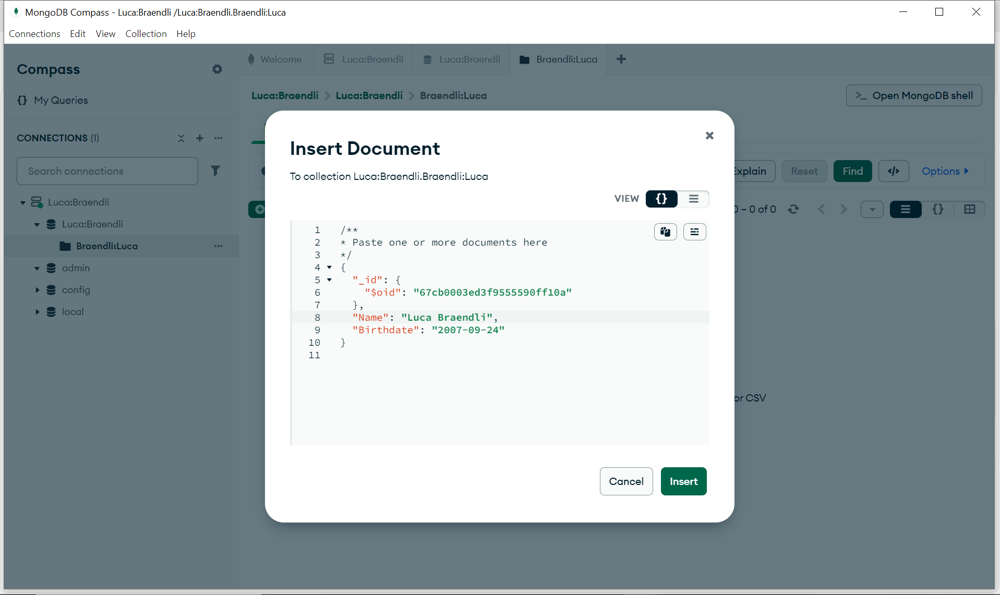
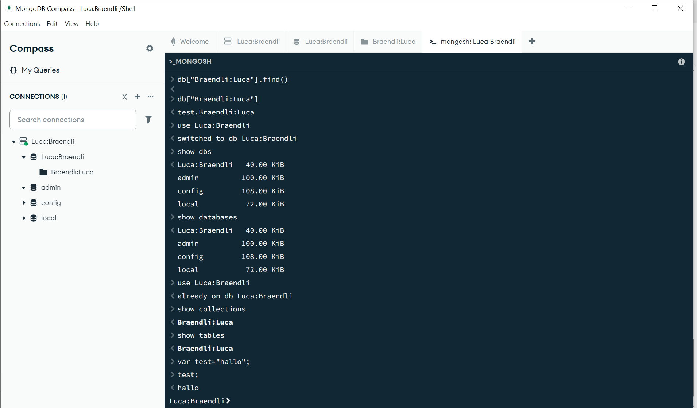
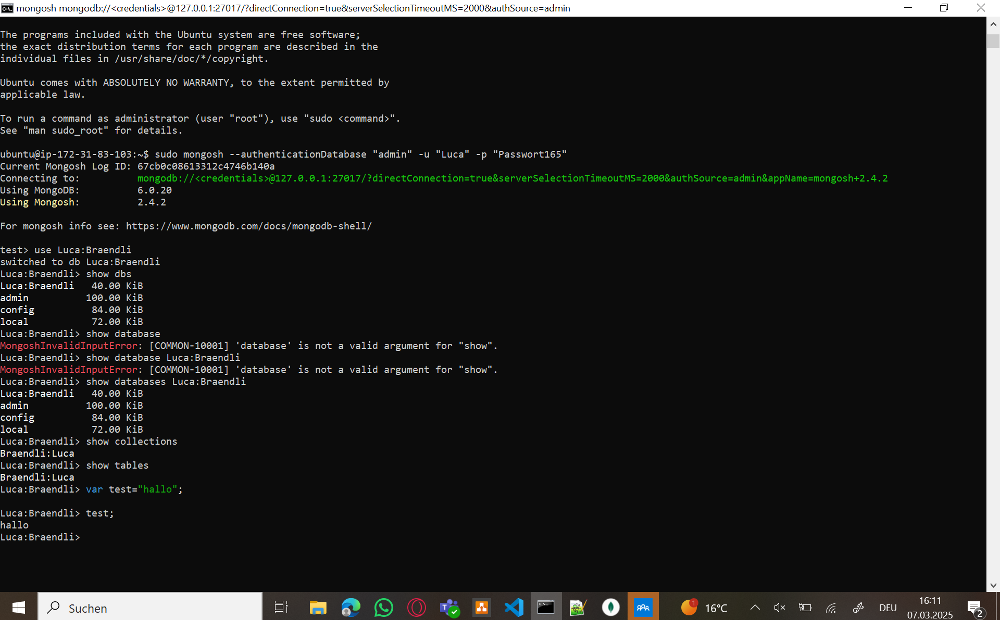

Die Option authSource=admin gibt an, dass die Authentifizierung über die admin-Datenbank erfolgt. Dies ist korrekt, weil Benutzerrechte in MongoDB standardmäßig in der admin-Datenbank gespeichert werden, auch wenn sie auf andere Datenbanken zugreifen.

sudo sed -i 's/127.0.0.1/0.0.0.0/g' /etc/mongod.confDieser Befehl ersetzt die Standard-IP 127.0.0.1 durch 0.0.0.0 in der MongoDB-Konfigurationsdatei /etc/mongod.conf. Dadurch wird der MongoDB-Server nicht mehr nur lokal erreichbar sein, sondern auch von anderen Geräten im Netzwerk.

sudo sed -i 's/#security:/security:\n  authorization: enabled/g' /etc/mongod.confHier wird die auskommentierte #security:-Zeile aktiviert und die authorization: enabled-Option hinzugefügt. Dies bedeutet, dass MongoDB nun Benutzer-Authentifizierung erfordert, bevor auf die Datenbank zugegriffen werden kann.

Diese Befehle ändern Konfigurationswerte in der MongoDB-Konfigurationsdatei, um die Authentifizierung korrekt zu setzen und den Zugriff über das Netzwerk zu ermöglichen.

**B**

MongoDB speichert Daten im BSON-Format. Standard-JSON kennt jedoch keine expliziten Datumswerte und speichert sie als Strings. Damit ein Datum als echtes Datum erkannt wird, muss $date explizit angegeben werden.

**C**

show dbs; → Zeigt alle vorhandenen Datenbanken an.

show databases; → Alternative Schreibweise für das Anzeigen von Datenbanken.

use Ihre-Datenbank; → Wechselt zur angegebenen Datenbank.

show collections; → Zeigt die vorhandenen Collections in der aktuellen Datenbank.

show tables; → Alias für show collections;.

var test="hallo"; → Erstellt eine JavaScript-Variable.

test; → Gibt den Wert der Variable aus.

