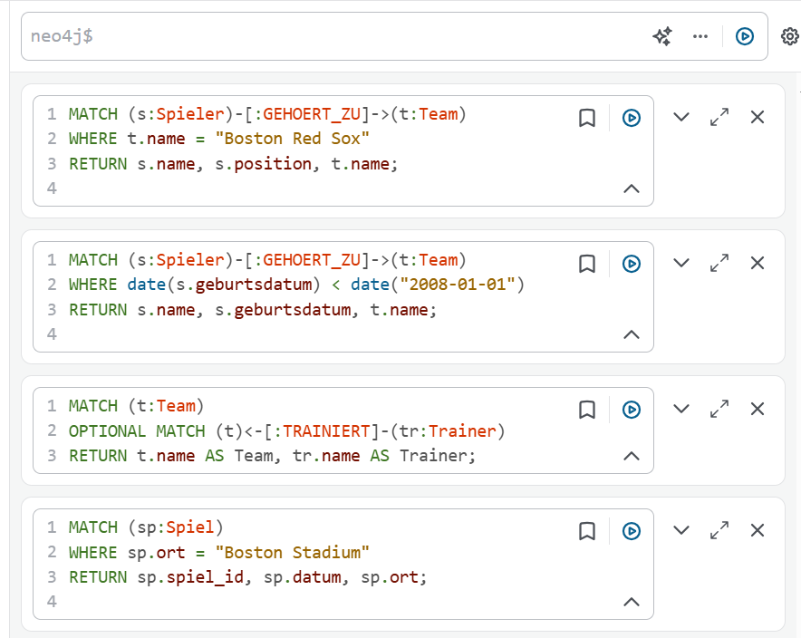

A)
textfile.txt

B)

Statement: MATCH (n) OPTIONAL MATCH (n)-[r]->(m) RETURN n, r, m;

MATCH (n): Findet alle Knoten in der Datenbank

Spiele an einem bestimmten Ort abrufen
MATCH (sp:Spiel)
WHERE sp.ort = "Boston Stadium"
RETURN sp.spiel_id, sp.datum, sp.ort;

Trainer und ihre Teams anzeigen, auch wenn kein Trainer existiert
MATCH (t:Team)
OPTIONAL MATCH (t)<-[:TRAINIERT]-(tr:Trainer)
RETURN t.name AS Team, tr.name AS Trainer;

Spieler mit Geburtsjahr vor 1995 anzeigen
MATCH (s:Spieler)-[:GEHOERT_ZU]->(t:Team)
WHERE date(s.geburtsdatum) < date("2008-01-01")
RETURN s.name, s.geburtsdatum, t.name;

Spieler eines bestimmten Teams abrufen
MATCH (s:Spieler)-[:GEHOERT_ZU]->(t:Team)
WHERE t.name = "Boston Red Sox"
RETURN s.name, s.position, t.name;

C)

Spieler ohne DETACH DELETE löschen (führt zu Fehlern, falls Beziehungen bestehen)
MATCH (s:Spieler {spieler_id: 101})
DELETE s;
Spieler mit DETACH DELETE löschen (empfohlen)
MATCH (s:Spieler {spieler_id: 101})
DETACH DELETE s;

D)

MATCH (t:Team {name: "Boston Red Sox"})
SET t.name = "Boston Ultras"
RETURN t;

MATCH (s:Spieler {name: "Luca"})
SET s.position = "First Baseman", s.nationalität = "Swiss"
RETURN s;

MATCH (t:Team {name: "Chicago Cubs"})<-[:TRAINIERT]-(oldTrainer:Trainer)
MATCH (newTrainer:Trainer {name: "Noah"})
CREATE (newTrainer)-[:TRAINIERT]->(t)
RETURN t, newTrainer;

E)

Merge
Erklärung
MERGE stellt sicher, dass ein Knoten oder eine Beziehung nur dann erstellt wird, wenn sie noch nicht existiert. Falls der Knoten oder die Beziehung bereits vorhanden ist, wird nichts geändert.

Anwendungsfall
Angenommen, wir möchten sicherstellen, dass das Team „Boston Red Sox“ nur einmal in der Datenbank existiert, egal ob das Skript mehrmals ausgeführt wird.

Beispiel 1
MERGE (t:Team {name: "Boston Red Sox", city: "Boston"})
RETURN t;
Falls „Boston Red Sox“ bereits existiert, passiert nichts. Falls nicht, wird es erstellt.

Beispiel 2
MATCH (p:Spieler {name: "Levi"}), (t:Team {name: "Boston Red Sox"})
MERGE (p)-[:GEHOERT_ZU]->(t);
Levi Betts bereits mit dem Team verknüpft ist, wird keine doppelte Beziehung erstellt.

Foreach
Erklärung
FOREACH wird verwendet, um Operationen für jede einzelne Komponente einer Liste auszuführen. Das ist nützlich, wenn du mehrere Knoten oder Beziehungen in einem Schritt ändern möchtest.

Anwendungsfall
Wir wollen eine Liste von Spielern auf einmal zu einem Team hinzufügen.

Beispiel 1
MATCH (t:Team {name: "Chicago Cubs"})  
WITH t, ["Derek Jeter", "Alex Rodriguez", "Mariano Rivera"] AS spielerListe  
FOREACH (spielerName IN spielerListe |  
    MERGE (s:Spieler {name: spielerName})  
    MERGE (s)-[:GEHOERT_ZU]->(t)  
);
Wir definieren eine Liste mit Spielernamen.

Für jeden Namen in der Liste:

Falls der Spieler nicht existiert, wird er erstellt.

Falls die Beziehung nicht existiert, wird sie hinzugefügt.

So können wir mehrere Spieler mit einer einzigen Abfrage zu einem Team hinzufügen.